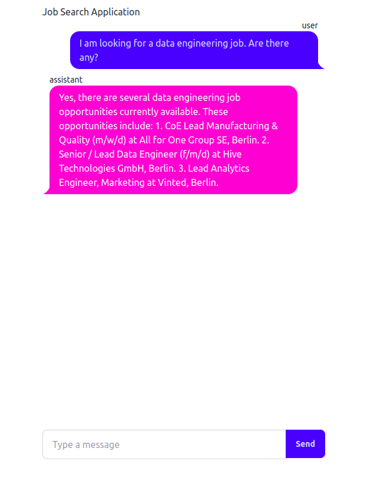

# job-search-application

This is an application using a LLM to help you analysis relevant job postings. Job postings
are fetched from [job tensor](https://jobtensor.com). A RAG approach is used to answer 
question related to the job postings and support job seekers. With the help of the LLM a
user can "chat" with the job postings and get support for writing an application or preparing
for a job interview.

Looking for relevant jobs is time-consuming, I hope this Job Search Application can help
to find relevant jobs faster.


This project was implemented for the [LLM Zoomcamp](https://github.com/DataTalksClub/llm-zoomcamp) -
a free course about LLMs and RAG.

## Dataset

The dataset used in this project was fetched via the python script `job_data_fetcher.py`. It contains
information concerning job postings on [job tensor](https://jobtensor.com). The following fields are
used:

- **id**: A internal unique ID to identify the jobs. (int)
- **title**: The job title. (string)
- **company**: The company name. (string)
- **locations**: The city where the job is located. (string)
- **skills**: A comma separated list of skills that the applicant should have. (string)
- **posted_at**: The date the job was posted. (string)
- **is_remote**: If the job is remote (False or True). (string)
- **snippet_fragments**: A summary of the job given on the website as highlight. (string)
- **description**: A detailed job description which can contain html formatting. (sting)

The idea is that the dataset is updated regularly so that the user can investigate the most
relevant job opportunities.

You can find an initial small dataset here: [`data/job_data.json`](data/job_data.json)

## Technologies

- Python 3.12
- Docker and Docker Compose for containerization
- [Minsearch](https://github.com/alexeygrigorev/minsearch) for full-text search
- FastAPI as API interface (see [Background FastAPI](#FastAPI) for more information on FastAPI)
- Grafana for monitoring and PostgreSQL as the backend for it
- AI21Studio as an LLM (see [Background AI21Studio](#AI21Studio) for more information on AI21Studio)
- fastHTML as simple UI (see [Background fastHTML](#fastHTML) for more information on fastHTML)

## Preparation

For using AI21Studio a API key is required. Before starting you should set it via 
`export AI21_API_KEY="<YOUR_API_KEY>"`.

You will get the key from the [AI21Studio website](https://studio.ai21.com/) after signing up.

I used pyenv to create a virtual environment with python 3.12 and installed the relevant packages 
with the help of the [`requirements.txt`](requirements.txt) file. 

```bash
pyenv virtualenv 3.12.7 job_search_application
pyenv activate job_search_application
pip install -r requirements.txt
```

## Running the application

### Database configuration

The database must be initialized before the application is started for the first time. This can be done
by running the [`db_prep.py`](job_search_application/db_prep.py) script.

```bash
docker-compose up postgres
export POSTGRES_HOST=localhost
python job_seach_application/db_prep.py
```

### Running with Docker-Compose

Subsequently, you can run the application via `docker-compose`.

```bash
docker-compose up
```

## Using the application

### Using `requests`

The [`main.py`](main.py) file gives an example of how to use the application in python with
the help of the requests library. First, a query is provided and then feedback is given.

```bash
python main.py
```

### Using CURL

An alternative to using python is `curl`. `curl` allows you to communicate via the command line
with the application.

```bash
URL=http://localhost:8000
QUERY="Is there a junior level job for a data scientist?"
DATA='{"query": "'${QUERY}'"}'
curl -X POST -H "Content-Type: application/json" -d "${DATA}" ${URL}/query
```

As a result you will get something like this:

```json
{
  "conversation_id":"ece20dd3-caf7-4f39-83ac-197b67c2937b",
  "query":"Is there a junior level job for a data scientist?",
  "response":"No, there is currently no junior level job for a data scientist."
}
```

You can send feedback in the same way:

```bash
URL=http://localhost:8000
CID="ece20dd3-caf7-4f39-83ac-197b67c2937b"
FEEDBACK='{"conversation_id": "'${CID}'", "feedback": 1}'
curl -X POST -H "Content-Type: application/json" -d "${FEEDBACK}" ${URL}/feedback
```

Which should result in:

```json
{
  "message":"Thank you for your feedback conversation ece20dd3-caf7-4f39-83ac-197b67c2937b: 1"
}
```

### Using basic fastHTML UI

You can also use a very simple chat interface which is still experimental. Just type in

```bash
python job_search_application/chat_interface.py
```

after running fastAPI. You should be able to navigate to [`http://localhost:5001/`](http://localhost:5001/)
and see something similar to this:



This will be further improved in the future.

## Code

The python code is organised as a python package in the [`job_search_application'](job_search_application) folder:

- [`app.py`](job_search_application/app.py) - setup for the FastAPI
- [`rag.py`](job_search_application/rag.py) - RAG logic
- [`ingest.py`](job_search_application/ingest.py) - loading data from json file
- [`minsearch.py`](job_search_application/minsearch.py) - in-memory search engine taken from the course
- [`db.py`](job_search_application/db.py) - logic storing requests and responses to postgres
- [`db_prep.py`](job_search_application/db_prep.py) - script for database initialisation

## Notebooks

### Retrieval evaluation

Unfortunately, the search was a bit challenging, since many questions are similar and the quality of the
questions created by the LLM was limited. I changed jamba-1.5-mini to jamba-1.5-large which helped a little bit.

I decided to go for `num_results=5` and to optimise for `hit_rate`. I believe it will be important that the job is
within the hits, it does not have to be the first. I do not want to have too many results in the prompt, because
the job description is quite long which will lead to an issue.


The evaluation of the test and validation data showed that the search parameters are overfitted on the validation
data. However, the overall performance is still slightly better. This part will require some future improvement.

```pyhon
def minsearch_improved(query):
    boost = {
      'title': 2.37,
      'company': 2.19,
      'locations': 0.22,
      'skills': 1.71,
      'posted_at': 1.77,
      'is_remote': 0.29,
      'snippet_fragments': 1.96,
      'description': 0.08
    }

    results = index.search(
        query=query,
        filter_dict={},
        boost_dict=boost,
        num_results=5
    )

    return results
```

The experiments can be found in the notebook [`retrival_evaluation`](notebooks/retrival_evaluation.ipynb).

### RAG evaluation

For this project I compared 3 different prompts. The first, I created myself similar to what was used in the course.
For the second and third, I asked ChatGPT and Claude to improve the prompt.

I asked the LLM this question to improve the prompt:

```
Act as an expert prompt engineer. How would you improve this prompt which is meant for a RAG application for looking at job postings and helping job seekers?

prompt_template = """
You're an expert application coach. Answer the QUESTION based on the CONTEXT from the job database.
Use only the facts from the CONTEXT when answering the QUESTION.

QUESTION: {question}

CONTEXT:
{context}
""".strip()

entry_template = """
job_title: {title}
company_name: {company}
work locations: {locations}
highlighted skills: {skills}
date of posting: {posted_at}
short job summary: {snippet_fragments}
detailed job description: {description}
""".strip()
```

Performance simple prompt:

| Relevance        | Count | Percentage |
|------------------|-------|------------|
| RELEVANT         | 32    | 64.0%      |
| PARTLY_RELEVANT  | 16    | 32.0%      |
| NON_RELEVANT     | 2     | 4.0%       |

Performance prompt improved by ChatGPT:

| Relevance        | Count | Percentage |
|------------------|-------|------------|
| RELEVANT         | 33    | 70.2%      |
| PARTLY_RELEVANT  | 9     | 19.2%      |
| NON_RELEVANT     | 5     | 10.6%      |

Performance prompt improved by Claude:

| Relevance        | Count | Percentage |
|------------------|-------|------------|
| RELEVANT         | 30    | 60.0%      |
| PARTLY_RELEVANT  | 16    | 32.0%      |
| NON_RELEVANT     | 4     | 8.0%       |

For the evaluation I took only 50 questions, because it took very long. The experiments can be found 
in the notebook [`rag_evaluation`](notebooks/rag_evaluation.ipynb).

## Monitoring

The Job Search Application uses Grafana for monitoring and for visualization.

Grafana can be accessed at `localhost:3000` with the following credentials:

- Username: admin
- Password: admin

The monitoring dashboard includes several panels that provide insights into various aspects of the application:

- Last 5 Conversations (Table): Displays details of the five most recent conversations, such as the question, answer, relevance, and timestamp. This panel helps keep track of the latest interactions.
- +1/-1 (Pie Chart): Shows a pie chart of user feedback, categorizing responses as positive or negative to monitor satisfaction levels.
- Relevancy (Gauge): Depicts a gauge chart indicating the relevance of responses. The chart uses color-coded thresholds to signify varying response quality levels.
- AI21Studio Cost (Time Series): Illustrates a time series of costs associated with AI21Studio usage, helping to monitor and analyze expenses over time.
- Tokens (Time Series): Tracks token usage over time in a line chart, allowing an overview of conversation volume and usage patterns.
- Model Used (Bar Chart): Provides a bar chart view of conversation counts by AI model type, offering insights into model usage frequency.
- Response Time (Time Series): Displays response times over time with a line chart, useful for identifying any performance issues affecting system responsiveness.

The configuration for Grafana can be found in the [`grafana'](grafana) folder:

- [`grafana_prep.py`](grafana/grafana_prep.py): Script for initializing the data source and dashboard setup.
- [`dashboard.json`](grafana/dashboard.json): The dashboard configuration file (imported from LLM Zoomcamp, unchanged).

To initialize the dashboard, first ensure that Grafana is running (docker-compose up will start it automatically).
Next, execute the following commands:

```bash
export POSTGRES_HOST=localhost
python grafana/grafana_prep.py
```

Finally, you can access Grafana at `localhost:3000`.

## Background

Some additional information on resources that were not covered directly in the course.

### FastAPI

FastAPI is a modern, fast (high-performance), web framework for building 
APIs with Python based on standard Python type hints. It can be used to
create endpoints that can be communicated with via web clients like `curl`
and `requests`.

In our case, we can send queries to `http://localhost:8000/question`.

You can find more information on the [official FastAPI website](https://fastapi.tiangolo.com/).

### AI21Studio

AI21 Studio is a platform developed by AI21 Labs that provides advanced natural 
language processing (NLP) tools and APIs for creating AI-driven applications. It 
offers access to powerful language models, like Jamba-1.5, which are capable of 
tasks such as text generation, summarization, translation, and more. 

The interface of AI21Studio is very similar to OpenAI so that it is very easy to use
if you are familiar with OpenAI. In addition, they provide you with 10$ of free credit
when signing up.

You can find more information on the [official AI21Studio website](https://studio.ai21.com/).

### FastHTML

FastHTML is a lightweight and efficient Python package designed for parsing and manipulating HTML 
documents with ease. It provides a simple interface to extract, modify, and analyze HTML content, 
making it an excellent choice for web scraping, data extraction, or any task involving HTML processing. 
FastHTML is optimized for speed and minimal memory usage, ensuring quick parsing even with large HTML files.

For more detailed information and usage examples, please refer to the official 
[FastHTML documentation](https://fastht.ml/).
